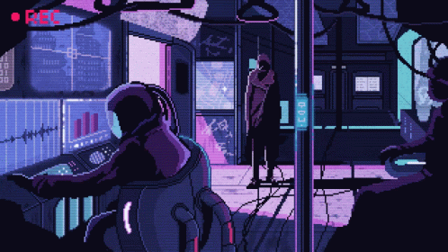

%%html

    
    
    <h1 align="left">Hi there! 👋 I'm Carlos Martinez</h1>
    <h3 align="left">A passionate developer from Colombia</h3>
    <h4 align="left">I love to learn new things.</h4>
    

    -🔭 Currently, I am working on improving my **Cloud Computer skills**. - 🌱 I am currently learning **GCP**. - 💬 Feel free to ask me about **anything**.  I am always happy to **learn more**. - 📫 How to reach me: .... - 😄 Pronouns: **...** - ⚡ Fun Fact: I love playing **...**.  
    

